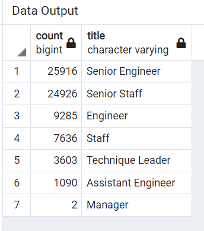
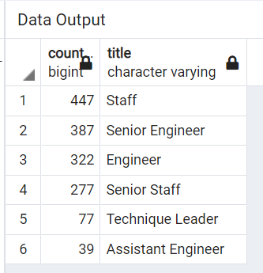

# Pewlett_Hackard_Analysis

# Overview

Purpose

The purpose of the module was to help update and organize the companies employee database. Learning about how to organize and set up a database requires us to think ahead to devize an intutive layout. We are given the task to help update the employee data seeing as managerial roles have changed over time, as well as, some employees have left the company. In order to have an updated list, we learned how to use postgresSQL language and the pgAdmin GUI to query, filter, join, and craete new tables that hold the data we want.

# Results

Deliverable 1
- We were able to remove duplicates of the employees by filtering for specific titles
- Then, we used length of employment to rule out those who have left the company, creating a complete and updated list of all retirees

Deliverable 2
- To get a better idea of how many employees would be leaving and to know which departments would benefit the most from mentorship, we filtered again by unique employee numbers, their age, and that they were still working within the company.
- Using the following criteria, we could then clearly see who would be most eligible to be a mentor to the newer employees 

# Summary

1) How many roles will need to be filled as the "silver tsunami" begins to make an impact?

The count by title for roles to be filled are as follows:
25,916 Senior Engineers, 24,926 Senior Staffers, 9,285 Engineers, 7,636 Staffers, 3,603 Technique Leaders, 1,090 Assistant Engineers, and 2 Managers.

2) Are there enough qualified, retirement-ready employees in the departments to mentor the next generation of Pewlett Hackard employees?

I believe there are enough qualified retirement-ready employees in the department to mentor the next generation of employees given we have a substancial number from each department as shown in the table.

